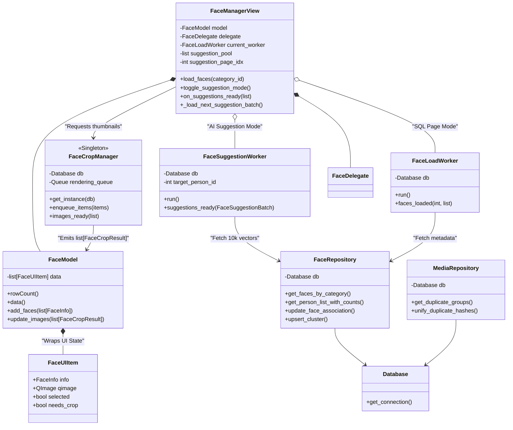

# Class Diagram (v3.5 - Phase 3 Type-Safe Arch)

```mermaid
classDiagram
    class Database {
        +get_connection()
    }
    
    class FaceRepository {
        -Database db
        +get_faces_by_category()
        +get_person_list_with_counts()
        +update_face_association()
        +upsert_cluster()
    }

    class MediaRepository {
        -Database db
        +get_duplicate_groups()
        +unify_duplicate_hashes()
    }
    
    class FaceUIItem {
        +FaceInfo info
        +QImage qimage
        +bool selected
        +bool needs_crop
    }

    class FaceManagerView {
        -FaceModel model
        -FaceDelegate delegate
        -FaceLoadWorker current_worker
        -list suggestion_pool
        -int suggestion_page_idx
        +load_faces(category_id)
        +toggle_suggestion_mode()
        +on_suggestions_ready(list)
        +_load_next_suggestion_batch()
    }

    class FaceCropManager <<Singleton>> {
        -Database db
        -Queue rendering_queue
        +get_instance(db)
        +enqueue_items(items)
        +images_ready(list)
    }

    class FaceModel {
        -list[FaceUIItem] data
        +rowCount()
        +data()
        +add_faces(list[FaceInfo])
        +update_images(list[FaceCropResult])
    }

    class FaceSuggestionWorker {
        -Database db
        -int target_person_id
        +run()
        +suggestions_ready(FaceSuggestionBatch)
    }

    class FaceLoadWorker {
        -Database db
        +run()
        +faces_loaded(int, list)
    }

    FaceManagerView *-- FaceModel
    FaceManagerView *-- FaceDelegate
    FaceManagerView o-- FaceLoadWorker : "SQL Page Mode"
    FaceManagerView o-- FaceSuggestionWorker : "AI Suggestion Mode"
    FaceManagerView --> FaceCropManager : "Requests thumbnails"
    
    FaceModel *-- FaceUIItem : "Wraps UI State"
    FaceCropManager --> FaceModel : "Emits list[FaceCropResult]"
    FaceSuggestionWorker --> FaceRepository : "Fetch 10k vectors"
    FaceLoadWorker --> FaceRepository : "Fetch metadata"
    FaceRepository --> Database
    MediaRepository --> Database
```
