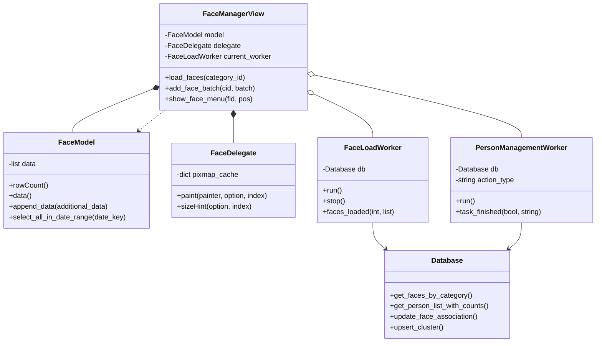

# Class Diagram

```mermaid
classDiagram
    class Database {
        +get_faces_by_category()
        +get_person_list_with_counts()
        +update_face_association()
        +upsert_cluster()
    }

    class FaceManagerView {
        -FaceModel model
        -FaceDelegate delegate
        -FaceLoadWorker current_worker
        +load_faces(category_id)
        +add_face_batch(cid, batch)
        +show_face_menu(fid, pos)
    }

    class FaceModel {
        -list data
        +rowCount()
        +data()
        +append_data(additional_data)
        +select_all_in_date_range(date_key)
    }

    class FaceDelegate {
        -dict pixmap_cache
        +paint(painter, option, index)
        +sizeHint(option, index)
    }

    class FaceLoadWorker {
        -Database db
        +run()
        +stop()
        +faces_loaded(int, list)
    }

    class PersonManagementWorker {
        -Database db
        -string action_type
        +run()
        +task_finished(bool, string)
    }

    FaceManagerView *-- FaceModel
    FaceManagerView *-- FaceDelegate
    FaceManagerView o-- FaceLoadWorker
    FaceManagerView o-- PersonManagementWorker
    FaceLoadWorker --> Database
    PersonManagementWorker --> Database
    FaceModel <.. FaceManagerView
```
