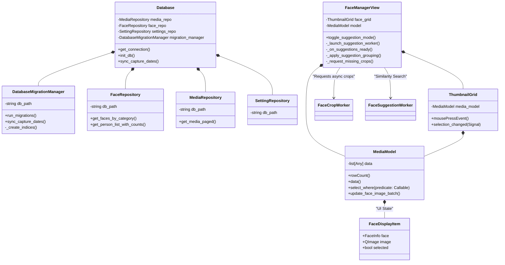

# Class Diagram (v4.5 Explosive Speed)

## Architectural Highlights (v4.5)
- **Concurrency & Safety**: `Database` provides `get_thread_local_connection()` to ensure safe multi-thread access. When combined with SQLite WAL mode, this design prevents `database is locked` errors during background processing.
- **Decoupled Lifecycle**: `Database` delegates all preparation (indexing, syncing) to `DatabaseMigrationManager`.
- **Predicate Selection**: `ThumbnailGrid` defines selection criteria via lambdas and injects them into `MediaModel.select_where()`.
- **Orchestrated UI**: `FaceManagerView` acts as a high-level orchestrator, decomposing complex result processing into specialized private helpers to maintain low cyclomatic complexity.
- **Model Implementation**: `MediaModel` is implemented in `ui.widgets.thumbnail_grid`, while data structures like `FaceDisplayItem` reside in `core.models`.
