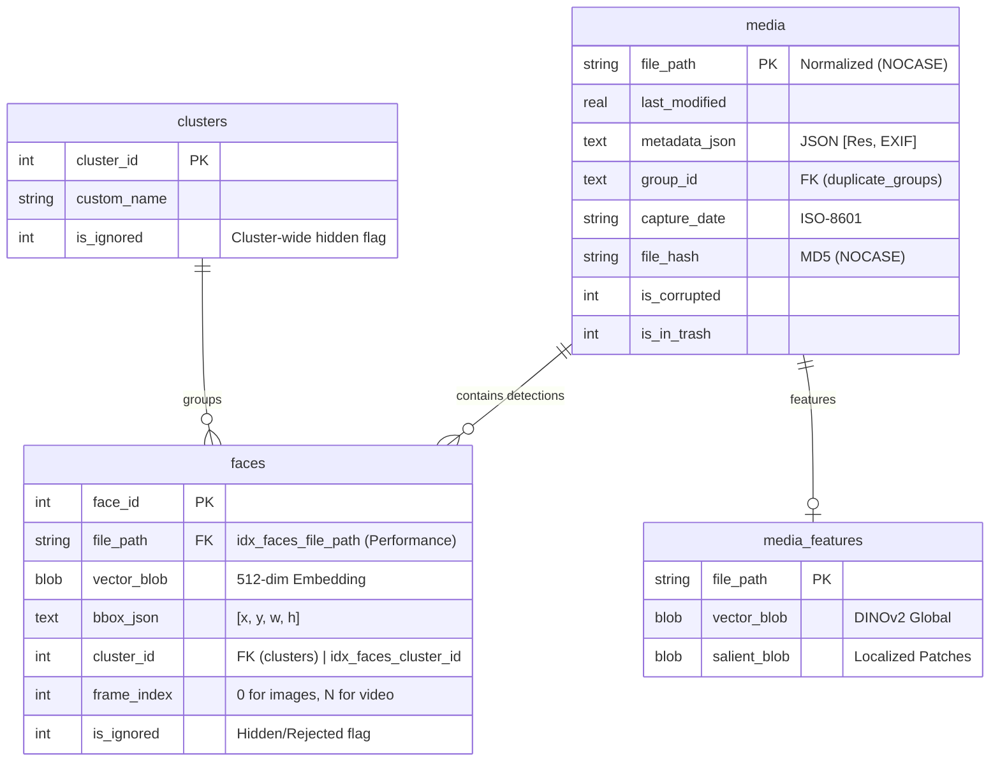

# ER Diagram (v3.4.1 Performance Tuned)

## Performance Note (v3.4.1)
- **`idx_faces_file_path`**: Critical index added to `faces` table to fix O(N^2) JOIN latency between `faces` and `media`.
- **`idx_faces_cluster_id`**: Accelerates person-specific queries and AI suggestion candidate fetching.
