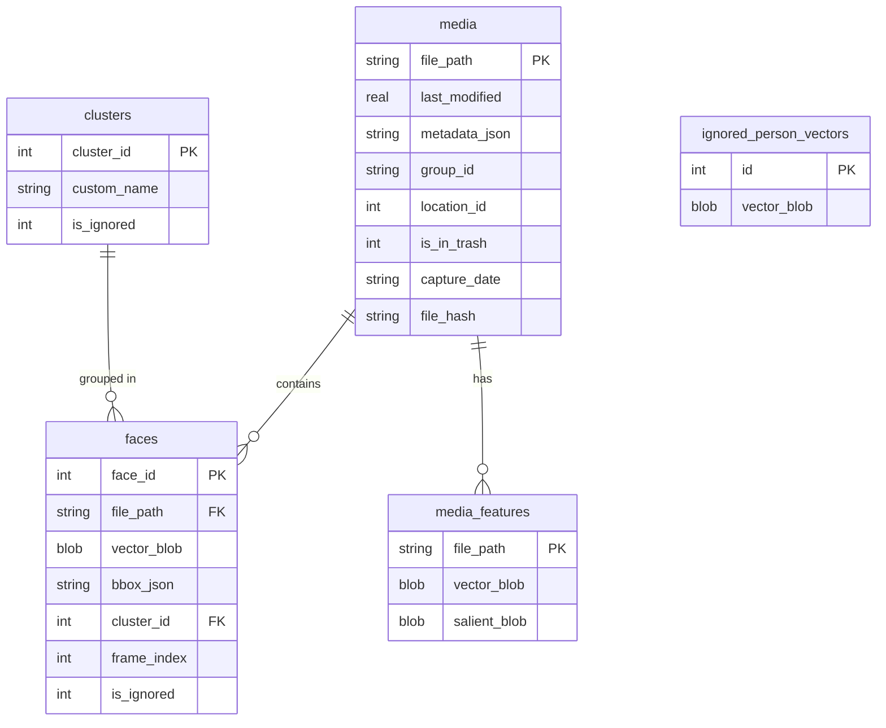

# ER Diagram

```mermaid
erDiagram
    media ||--o{ faces : "contains"
    media ||--o{ media_features : "has"
    clusters ||--o{ faces : "grouped in"
    
    media {
        string file_path PK
        real last_modified
        string metadata_json
        string group_id
        int location_id
        int is_in_trash
        string capture_date
        string file_hash
    }

    faces {
        int face_id PK
        string file_path FK
        blob vector_blob
        string bbox_json
        int cluster_id FK
        int frame_index
        int is_ignored
    }

    clusters {
        int cluster_id PK
        string custom_name
        int is_ignored
    }

    ignored_person_vectors {
        int id PK
        blob vector_blob
    }

    media_features {
        string file_path PK
        blob vector_blob
        blob salient_blob
    }
```
