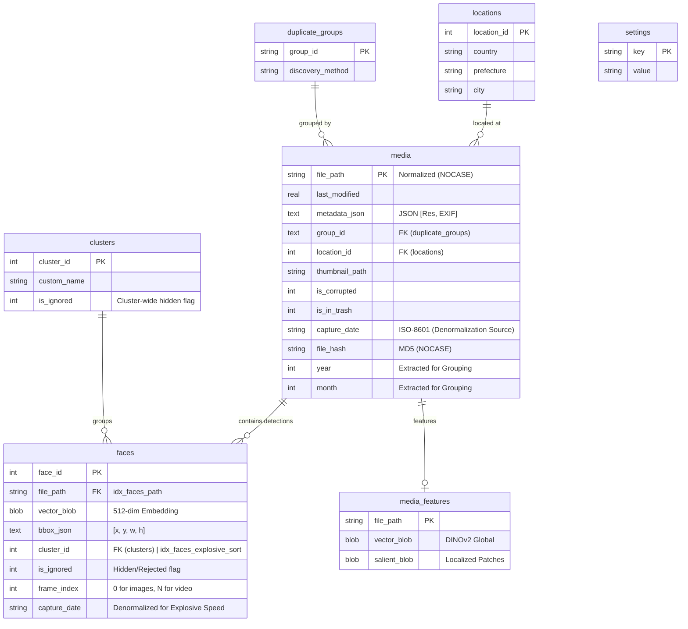

# ER Diagram (v4.5 Explosive Speed)

## Performance & Optimization Notes (v4.5)
- **Denormalized `faces.capture_date`**: Essential for sub-100ms sorting. By duplicating the media date into the faces table, we eliminate cross-table JOINs during filtered grid loading.
- **`idx_faces_explosive_sort`**: A composite index `(is_ignored, cluster_id, capture_date DESC)`. This index allows the SQLite engine to perform filtering and sorting in a single indexed operation, reducing latency from 100s to <100ms.
- **Index `idx_faces_path`**: Critical for joining with media-related metadata when explicitly required (e.g. detailed EXIF display).
