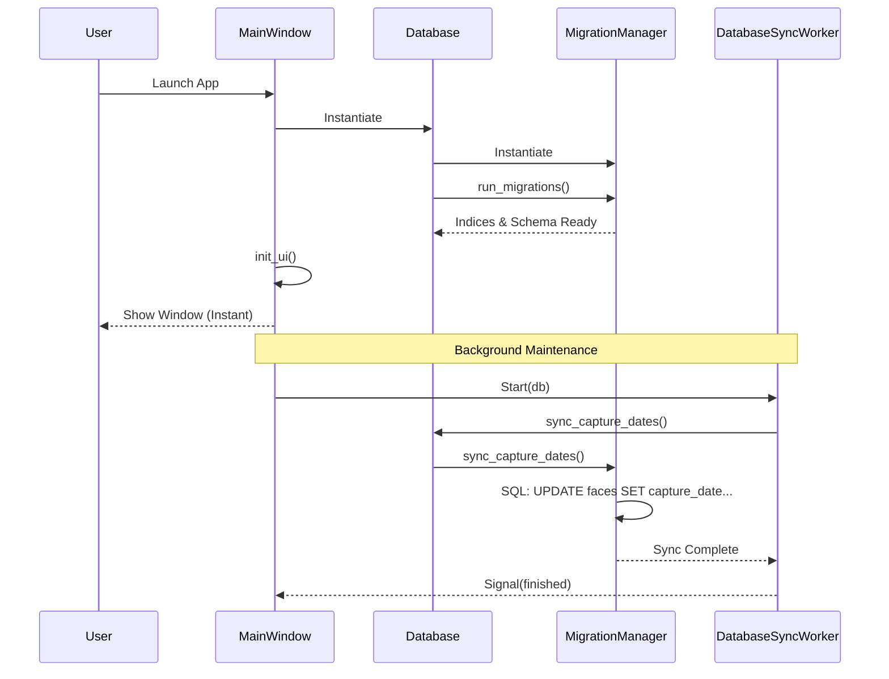
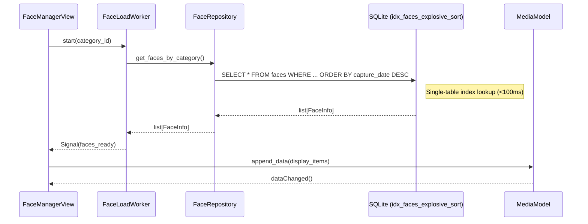
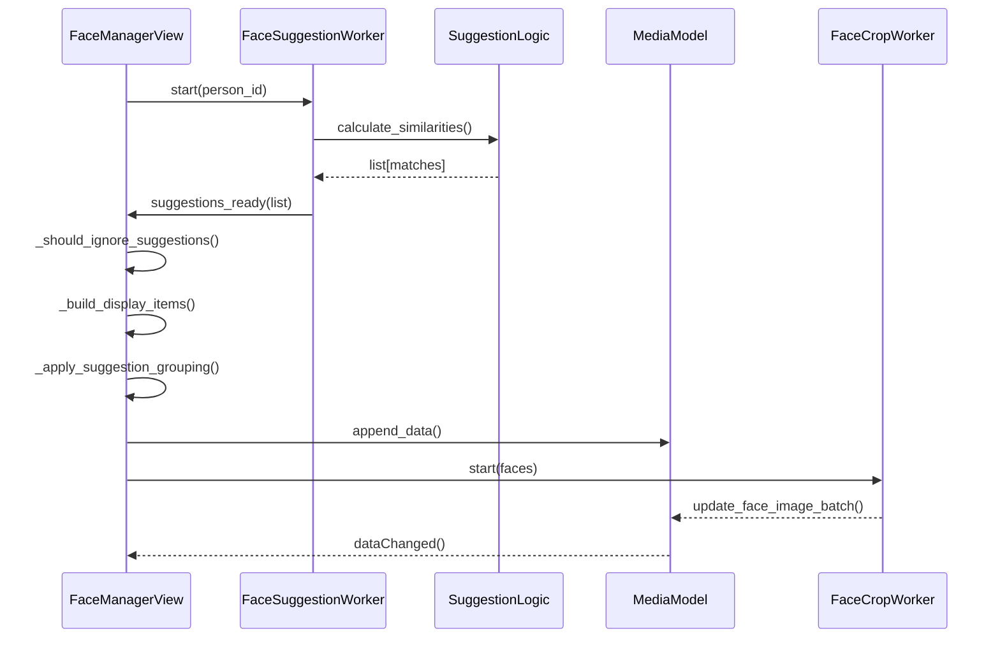

# Sequence Diagrams (v4.5 Explosive Speed)

## 1. Application Startup & Initialization
This sequence demonstrates how heavy database synchronization is offloaded to ensure an instant UI appearance.

## 2. Explosive Face Loading (Single Table Lookup)
Demonstrates sub-100ms loading by bypassing expensive JOINs and leveraging the explosive sort index.

## 3. Orchestrated AI Suggestions
Demonstrates the flattened processing flow in the UI layer.

