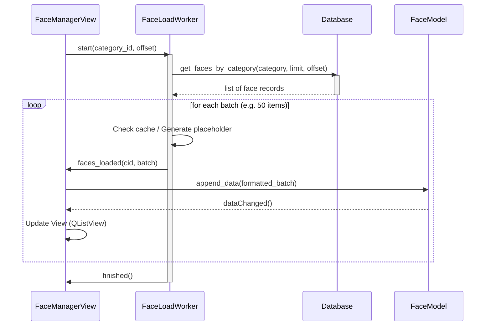

# Sequence Diagram - Face Loading Flow

```mermaid
sequenceDiagram
    participant UI as FaceManagerView
    participant Worker as FaceLoadWorker
    participant DB as Database
    participant Model as FaceModel

    UI->>Worker: start(category_id, offset)
    activate Worker
    Worker->>DB: get_faces_by_category(category, limit, offset)
    activate DB
    DB-->>Worker: list of face records
    deactivate DB
    
    loop for each batch (e.g. 50 items)
        Worker->>Worker: Check cache / Generate placeholder
        Worker->>UI: faces_loaded(cid, batch)
        UI->>Model: append_data(formatted_batch)
        Model-->>UI: dataChanged()
        UI->>UI: Update View (QListView)
    end

    Worker->>UI: finished()
    deactivate Worker
```
