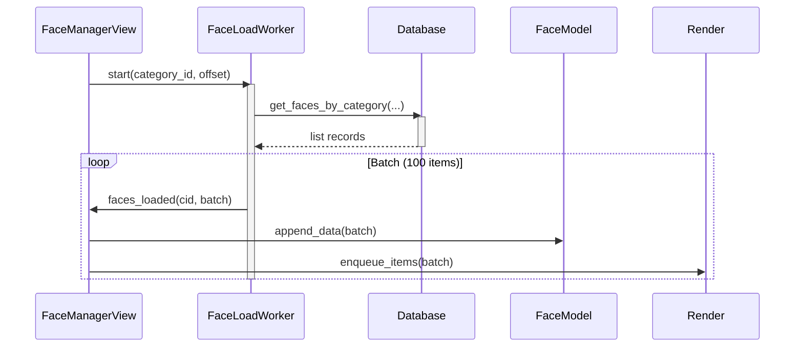
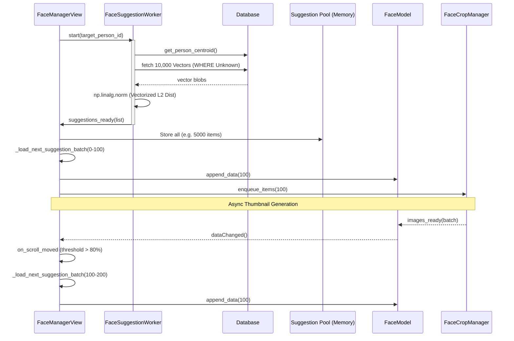

# Sequence Diagram - Face Loading & AI Suggestion Flows

## 1. SQL Category Loading (Standard)

```mermaid
sequenceDiagram
    participant UI as FaceManagerView
    participant Worker as FaceLoadWorker
    participant DB as Database
    participant Model as FaceModel

    UI->>Worker: start(category_id, offset)
    activate Worker
    Worker->>DB: get_faces_by_category(...)
    activate DB
    DB-->>Worker: list records
    deactivate DB
    
    loop Batch (100 items)
        Worker->>UI: faces_loaded(cid, batch)
        UI->>Model: append_data(batch)
        UI->>Render: enqueue_items(batch)
    end
    deactivate Worker
```

## 2. AI Suggestion Workflow (Vectorized Infinite Scroll)

```mermaid
sequenceDiagram
    participant UI as FaceManagerView
    participant AI as FaceSuggestionWorker
    participant DB as Database
    participant Pool as Suggestion Pool (Memory)
    participant Model as FaceModel
    participant Render as FaceCropManager

    UI->>AI: start(target_person_id)
    activate AI
    AI->>DB: get_person_centroid()
    AI->>DB: fetch 10,000 Vectors (WHERE Unknown)
    DB-->>AI: vector blobs
    
    AI->>AI: np.linalg.norm (Vectorized L2 Dist)
    AI->>UI: suggestions_ready(list)
    deactivate AI

    UI->>Pool: Store all (e.g. 5000 items)
    UI->>UI: _load_next_suggestion_batch(0-100)
    UI->>Model: append_data(100)
    UI->>Render: enqueue_items(100)
    
    Note over UI, Render: Async Thumbnail Generation
    Render-->>Model: images_ready(batch)
    Model-->>UI: dataChanged()

    UI->>UI: on_scroll_moved (threshold > 80%)
    UI->>UI: _load_next_suggestion_batch(100-200)
    UI->>Model: append_data(100)
```
