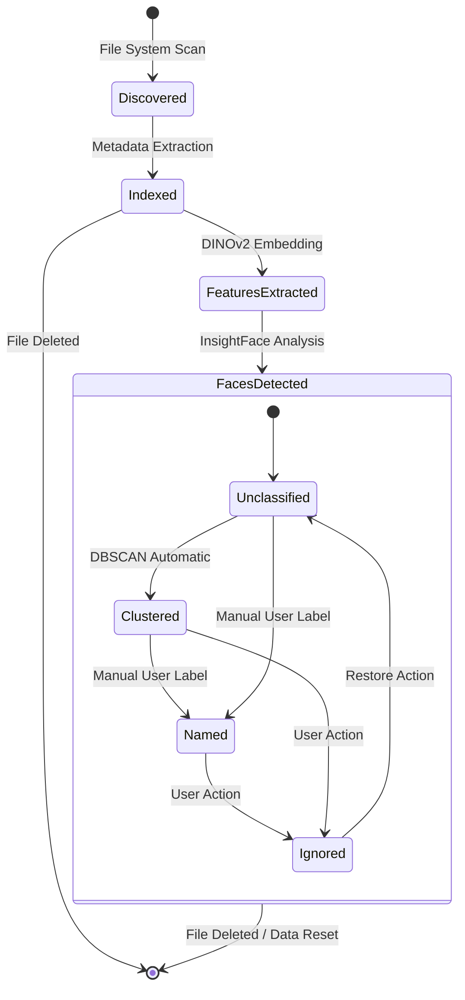

# State Machine Diagram - Media Processing Lifecycle

```mermaid
stateDiagram-v2
    [*] --> Discovered: File System Scan
    Discovered --> Indexed: Metadata Extraction
    Indexed --> FeaturesExtracted: DINOv2 Embedding
    FeaturesExtracted --> FacesDetected: InsightFace Analysis
    
    state FacesDetected {
        [*] --> Unclassified
        Unclassified --> Clustered: DBSCAN Automatic
        Clustered --> Named: Manual User Label
        Unclassified --> Named: Manual User Label
        Named --> Ignored: User Action
        Clustered --> Ignored: User Action
        Ignored --> Unclassified: Restore Action
    }
    
    Indexed --> [*]: File Deleted
    FacesDetected --> [*]: File Deleted / Data Reset
```
