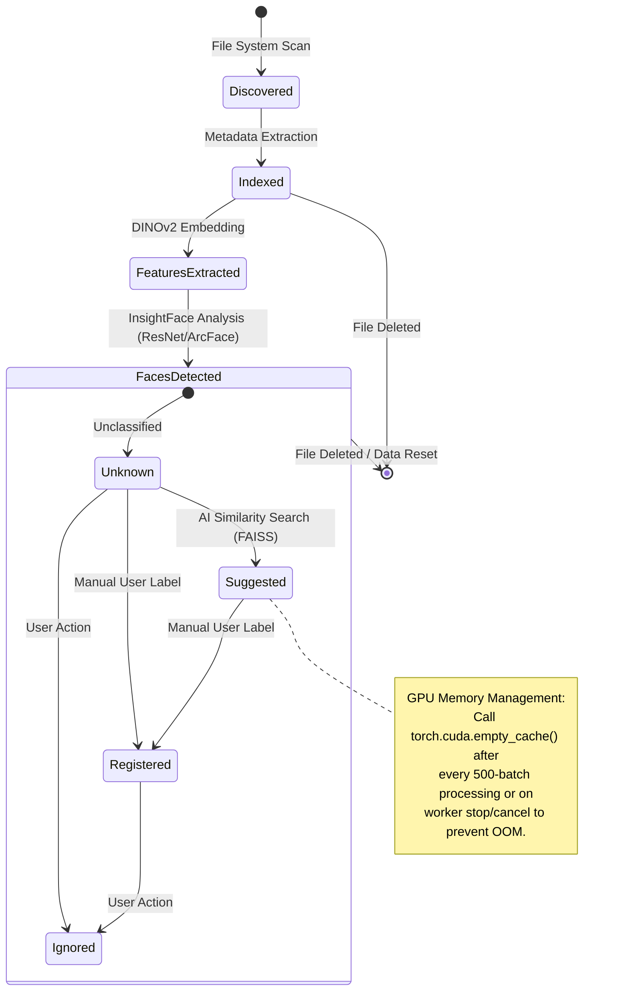
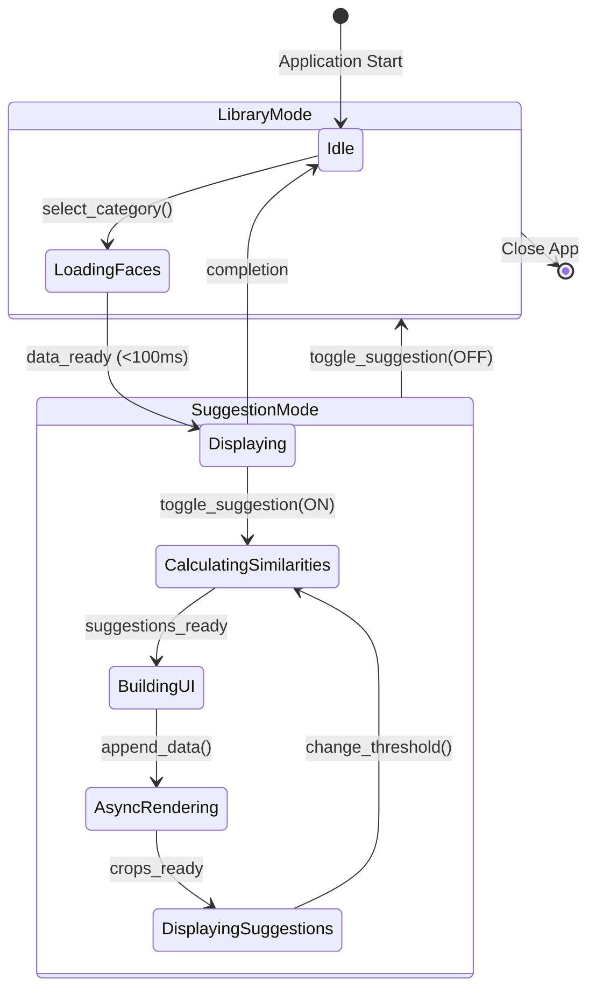

# State Machine Diagrams (v4.5 Explosive Speed)

## 1. Media Processing & AI Lifecycle
Defines the backend pipeline from file discovery to person registration.

## 2. Face Manager UI Interaction States (NEW v4.5)
Defines how the UI transitions between viewing and suggestion modes.

